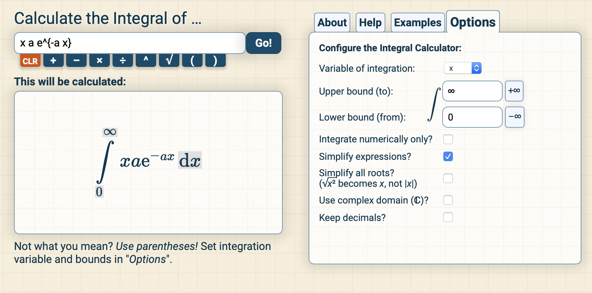
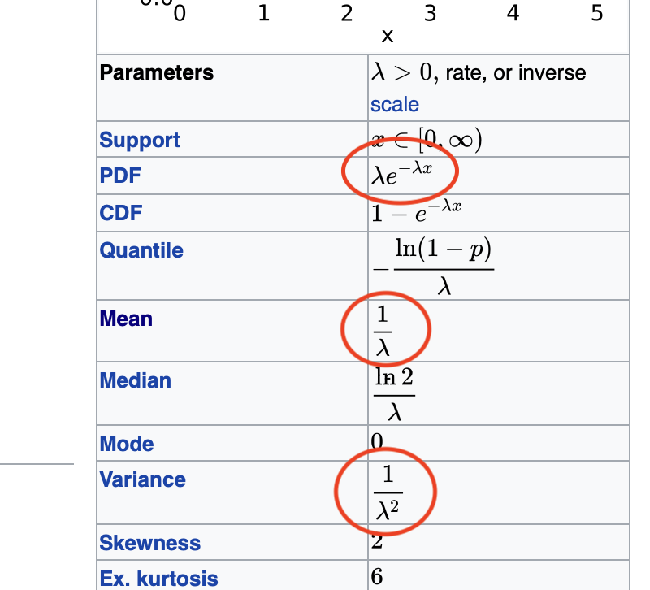
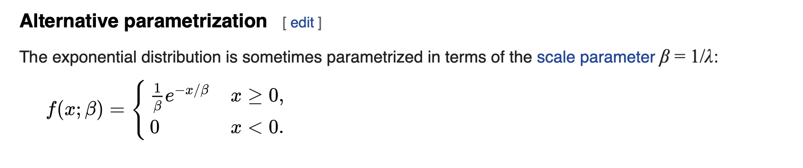
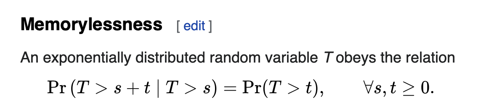

```{r setup, include=FALSE}
knitr::opts_chunk$set(echo = FALSE)

library(tidyverse)
```

## Revisions

You can find the latest versions of the slides in their [GitHub repo](https://github.com/pos5737/prob-slides). If you have any suggestions, feel free to [open an issue ticket](https://github.com/pos5737/prob-slides/issues).

# Basics

## Supplemental Readings for Section 1

The following readings expand on the ideas in these notes. FPP provides a nice conceptual discussion. Aronow and Miller give a more technical presentation, but remains gentle and compact. DeGroot and Schervish offer a thorough introduction. 

- FPP, chs. 13 and 14 (pp. 221-224)
- Aronow and Miller, ch. 1, section 1.1 (pp. 3-15)
- DeGroot and Schervish, ch. 1, sections 1.1-1.7, 1.10, 2.1-2.3.

## 

\begin{dfn}
An \textbf{experiment} is a repeatable procedure to obtain an observation from a defined set of outcomes.
\end{dfn}

\begin{dfn}
The \textbf{sample space} $S$ is the collection of all possible outcomes of the experiment.
\end{dfn}

\begin{dfn}
A \textbf{realization} of the experiment produces an outcome from the sample space.
\end{dfn}

\begin{dfn}
An \textbf{event} $A$ is a subset of the sample space.
\end{dfn}

## Axioms of Probability (Kolmogorov Axioms)
\small

\begin{axm}\label{axm:1}
For every event $A$, $\Pr(A) \geq 0$.
\end{axm}

\begin{axm}\label{axm:2}
$\Pr(S) = 1$.
\end{axm}

\begin{axm}\label{axm:3}
For every infinite sequence of disjoint events $A_1, A_2, ...$, 
\begin{equation}
\Pr \left( \displaystyle \bigcup_{i = 1}^\infty A_i \right) = \displaystyle \sum_{i = 1}^\infty \Pr(A_i). \nonumber
\end{equation}
\end{axm}

## Notes on Axiom \ref{axm:3}

Examples of an infinite sequence of disjoint events? For $S = \mathbb{R}^+$? For $S =\{0, 1\}$?

An infinite sequence of disjoint events is difficult to conceptualize. For $S = \mathbb{R}^+$, \textit{one} such sequence would be $[0, 1), [1, 2), [2, 3), ...$.  For $S =\{0, 1\}$, \textit{one} such sequence would be $\{0\}, \{1\}, \emptyset, \emptyset, \emptyset,...$.

## 

\begin{dfn}
For a sample space $S$, a \textbf{probability} is a collection of real numbers assigned to all events $A$ consistent with Axioms \ref{axm:1}, \ref{axm:2}, and \ref{axm:3}
\end{dfn}

## Interpretations of "Probability"

- We can interpret this probability of $A$ as the fraction of time that $A$ occurs in this long-run when we repeat the experiment over-and-over. This is known as the **frequentist** interpretation of probability. 
- We can also interpret the probability as your beliefs about $A$.  This is known as the **Bayesian** interpretation.

Coin Toss example.

##

\begin{thm}\label{thm:empty-zero}
$\Pr(\emptyset) = 0$. 
\end{thm}

\begin{Exercise}
Prove Theorem \ref{thm:empty-zero}. Hint: Use Axiom \ref{axm:3}.
\end{Exercise}

**Solution**

$\Pr(\emptyset) = \Pr(\cup_{i = 1}^\infty \emptyset) = \sum_{i = 1}^\infty \Pr(\emptyset)$. $\Pr(\emptyset) = \sum_{i = 1}^\infty \Pr(\emptyset)$ iff $\Pr(\emptyset) = 0$.

##


\begin{thm}\label{thm:add-disjoint}
For every finite sequence of $n$ disjoint events $A_1, A_2, ..., A_n$,
\begin{equation}
\Pr \left( \displaystyle \bigcup_{i = 1}^n A_i \right) = \displaystyle \sum_{i = 1}^n \Pr(A_i). \nonumber
\end{equation}
\end{thm}

\begin{cor}[Addition Rule for Two Disjoint Events]\label{cor:addition-rule}
For disjoint events $A$ and $B$, $\Pr ( A \cup B) = \Pr(A) + \Pr(B)$
\end{cor}

\begin{proof}
This follows directly from Theorem \ref{thm:add-disjoint}. 
\end{proof}

##

\begin{thm}\label{thm:monotonicity}
If events $A \subseteq B$, then $\Pr(A) \leq \Pr(B)$. 
\end{thm}

\begin{Exercise}
Prove Theorem \ref{thm:monotonicity}. Hint: Notice that $B = A \cup (B \cap A^c)$. Then use the Additional Rule for Two Disjoint Events (Corollary \ref{cor:addition-rule}).
\end{Exercise}

**Solution**

$B = A \cup (B \cap A^c)$. By the addition rule for disjoint events, $\Pr(B) = \Pr(A) + \Pr(B \cap A^c)$. By Axiom 1, $\Pr(B \cap A^c) \geq 0$, so $\Pr(A) \leq \Pr(B)$.

##

\begin{thm}\label{thm:bounds}
For event $A$, $0 \leq \Pr(A) \leq 1$. 
\end{thm}

\begin{Exercise}
Prove Theorem \ref{thm:bounds}. Hint: Axiom \ref{axm:1} established that $0 \leq \Pr(A)$. Now show that $\Pr(A) \leq 1$. To do this, use Axiom \ref{axm:2} and Theorem \ref{thm:monotonicity}.
\end{Exercise}

**Solution**

$A \subseteq S$. $\Pr(A) \leq \Pr(S)$. By Axiom 1, $\Pr(S) = 1$, so $\Pr(A) \leq 1$.

##

\begin{thm}[Addition Rule for Two Events]
For any events $A$ and $B$, $\Pr ( A \cup B) = \Pr(A) + \Pr(B) - \Pr(A \cap B)$.
\end{thm}

\begin{thm}[Addition Rule for Three Events]
For any events $A$, $B$, and $C$,
 \begin{align*}
 \Pr ( A \cup B \cup C) &= \Pr(A) + \Pr(B) + \Pr(C)\\
                                   &- \left[ \Pr(A \cap B) + \Pr(A \cap C) + \Pr(B \cap C) \right]\\
                                   &+ \Pr(A \cap B \cap C).
                                   \end{align*}
\end{thm}

##

\begin{Exercise} 
If they answer honestly and accurately, a randomly selected survey respondent will report voting in the 2016 presidential election with probability 0.6. What's the probability that a randomly selected survey respondent will report not voting. Make sure to connect your answer to the results above. Hint: show that $\Pr(A^c) = 1 - \Pr(A)$. We haven't established this simple, intuitive result. Then use this result to answer the question.
\end{Exercise}

**Solution**

$\Pr(S) = \Pr(A) + \Pr(A^c)$. Then $1 = \Pr(A) + \Pr(A^c)$ and $\Pr(A^c) =  1-  \Pr(A)$. Then $\Pr(\text{non-voter}) = 0.4$.

##

\begin{Exercise}
Suppose events $A$ and $B$, where $\Pr(A) = 0.5$ and $\Pr(B) = 0.8$. Without more information, you can't figure out $\Pr(A \cap B)$, but you can bound it. What is the largest possible value of $\Pr(A \cap B)$? What's the smallest?
\end{Exercise}

**Solution**

Remember that $\Pr(A \cap B) = \Pr(A)\Pr(B \mid A)$. Because $A$ is smaller than $B$, it could be that all of $A$ is inside $B$, in which case $\Pr(B \mid A) = 1$ and $\Pr(A \cap B) = \Pr(A) = 0.5$. Or it could be that $\Pr(B \mid A^c) = 1$, in which case $\Pr(B \cap A^c) = \Pr(B \mid A^c) \Pr(A^c) = 1 \times 0.5 = 0.5$. Then $\Pr(B) = \Pr(B \cap A^c) + \Pr(B \cap A) = 0.8$, according to the Addition Rule for Disjoint Events (that's a "partition, see below). So we have $.5 + \Pr(B \cap A)  = 0.8$ or $\Pr(B \cap A) = 0.3$.

##

\begin{dfn}[Conditional Probability]\label{dfn:conditional-probability}
$\Pr(A \mid B) = \dfrac{\Pr(A \cap B)}{\Pr(B)}$ for $\Pr(B) > 0$. If $\Pr(B) = 0$, then $\Pr(A \mid B)$ is undefined.
\end{dfn}

## A Note on Conditional Probability

We interpret the conditional probability $\Pr(A \mid B)$ as the probability of $A$ given that $B$ happens (or has already happened). Suppose a bag with two green marbles and two red marbles. I draw two marbles without replacement and see that the first is green. Then the probability that the second is green, given that the first is/was green, is

\small
\begin{equation*}
\Pr(\text{second is green} \mid \text{first is green}) = \frac{\Pr(\text{second is green AND first is green})}{\Pr (\text{first is green)}}.
\end{equation*}

## An Intuition for Conditional Probability

\huge

\textbf{Carlisle's Happy-Sad Principle}

\normalsize

If event $A$ happens, you win \$100. You see that event $B$ happens. Are you now \textbf{happy} (more likely to win), \textbf{sad} (less likely to win), or \textbf{indifferent} (equally likely to win)?


## A Visualization of Conditional Probability


## A Visualization of Conditional Probability


## A Visualization of Conditional Probability


##

\begin{thm}[Multiplication Rule for Two Events]
For events $A$ and $B$, $\Pr(A \cap B) = \Pr(B)\Pr(A | B)$ if $\Pr(B > 0)$. Similarly, $\Pr(A \cap B) = \Pr(A)\Pr(B | A)$ if $\Pr(A > 0)$.
\end{thm}

##

\begin{thm}[Multiplication Rule for $n$ Events]
For events $A_1, A_2,..., A_n$ where $\Pr(A_1 \cap A_2 \cap ... \cap A_{n-1}) > 0$,
\begin{align*}
\Pr(A_1 \cap A_2 \cap ... \cap A_n) &= \Pr(A_1)\\
    							& \times \Pr(A_2 \mid A_1)\\
							& \times \Pr(A_3 \mid A_2, A_1) \\
							& \times ...\\
							& \times \Pr(A_n \mid A_{n-1}, ..., A_2, A_1) 
\end{align*}
\end{thm}

## 

\begin{Exercise}
Simplify $\Pr(A \mid B)$ for the following scenarios. Connect your answers to the results above.
  \begin{enumerate}
  \item $A \subset B$ and $\Pr(B) > 0$.
  \item $A$ and $B$ are disjoint and $\Pr(B) > 0$.
  \item $B$ is the empty set (tricky!).
  \item $B$ is the sample space $S$.
  \end{enumerate}
\end{Exercise}

**Solution**

(1) $\Pr(A)/\Pr(B)$, (2) 0, (3) not defined, (4) $\Pr(A)\Pr(B)$

##

\begin{Exercise}
Voting is a habit. Suppose that elections occur every four years and a hypothetical voter can vote in their first election at 18 in 2020. They vote in their first election with probability 0.5. If they voted in the last election, then they vote in the next election with probability 0.8. If they abstained in the last election, then they vote in the next election with probability 0.3. What is the probability that they vote in their first three election (i.e., vote, then vote, then vote)? What the probability that they abstain in their first three elections (i.e., abstain, then abstain, then abstain)? What's the probability that they either vote or abstain in their first three elections (i.e., [vote, then vote, then vote] \textit{OR} [abstain, then abstain, then abstain])?
\end{Exercise}

**Solution**

$0.5 \times 0.8 \times 0.8$; $0.5 \times 0.7 \times 0.7$; the sum of the two previous


## 

\begin{dfn}[Independence of Two Events]\label{dfn:independence}
Events $A$ and $B$ are \textbf{independent} if $\Pr(A \cap B) = \Pr(A) \Pr(B)$.
\end{dfn}

If $\Pr(A) > 0$ and $\Pr(B) > 0$, then Definitions \ref{dfn:conditional-probability} and \ref{dfn:independence} imply that two events are independent if and only if their conditional probabilities equal their unconditional probabilities so that $\Pr(A \mid B) = \Pr(A)$ and $\Pr(B \mid A) = \Pr(B)$.

##

\begin{dfn}[Independence of $n$ Events]\label{dfn:independence-n}
Events $A_1, A_2, ..., A_n$ are \textbf{independent} if for every subset $A_a,..., A_m$ with at least two events, $\Pr(A_a \cap ... \cap A_m) = \Pr(A_a)...\Pr(A_m)$.
\end{dfn}

The "every subset'" part of Definition \ref{dfn:independence-n} is subtle, so let's create a specific example. "Every subset" of $A$, $B$, and $C$ with at least two events includes the following: $\{A, B\}$, $\{A, C\}$, $\{B, C\}$, and $\{A, B, C\}$. 

##

\begin{Exercise}
Suppose $A$ and $B$ are independent and $\Pr(B) < 1$. Find $\Pr(A^c | B^c)$ in terms of $A$ and $B$. Prove that $A^c$ and $B^c$ are independent.
\end{Exercise}

**Solution**

\scriptsize

First, show that $A^c$ and $B^c$ are independent. 

\begin{align*}
\Pr(A^c \cap B^c) & = \Pr([A \cup B]^c) \\
                  & = 1 - \Pr(A \cup B) \\
                  & = 1 - [\Pr(A) + \Pr(B) - \Pr(A \cap B)] \\
                  & = 1 - \Pr(A) - \Pr(B) + \Pr(A)\Pr(B) \\
                  & = [1 - \Pr(A)] \times [1 - \Pr(B)] \\
                  & = \Pr(A^c) \times \Pr(B^c)
\end{align*}

Then, by independence, we know that $\Pr(A^c | B^c) = \Pr(A^c)$ and that $\Pr(A^c) = 1 - \Pr(A)$.


##


\begin{Exercise}
Suppose $A$ and $B$ are events and $\Pr(B) = 0$. ($A$ is any event.) Find $\Pr(A \cap B)$. Prove that $A$ and $B$ are independent.
\end{Exercise}

**Solution**

If $A$ and $B$ are independent, then $\Pr(A \cap B) = \Pr(A) \Pr(B)$. Well, if $\Pr(B) = 0$, then $\Pr(A \cap B)$ must be zero. If the chance of $B$ is zero, then the chance of $A$ and $B$ is zero. Thus the two sides are equal and therefore independent.

##

\begin{Exercise}
Suppose a six-die is rolled 10 times. What's the probability of...
  \begin{enumerate}
  \item all sixes?
  \item not all-sixes?
  \item all not-sixes?
  \end{enumerate}
\end{Exercise}

**Solution**

(1) $(1/6)^{10}$, (2) $1 - (1/6)^{10}$, (3) $(5/6)^{10}$


##

\begin{dfn}\label{dfn:partition}
To create a \textbf{partition} $B_1, B_2, ..., B_k$ of the sample space $S$, divide $S$ into $k$ disjoint events $B_1, B_2, ..., B_k$ so that $\bigcup_{i = 1}^n B_i = S$.
\end{dfn}

\begin{thm}[Law of Total Probability]\label{thm:total-prob}
Suppose a partition (see Definition \ref{dfn:partition}) $B_1, B_2, ..., B_k$ of the sample space $S$ where $\Pr(B_j) > 0$ for $j = 1, 2, ... , k$. Then
\begin{equation*}
\Pr(A) = \displaystyle \sum_{j = 1}^k \Pr(B_j )\Pr(A \mid B_j).
\end{equation*}
\end{thm}

##

\begin{thm}[Bayes' Rule]
Suppose a partition (see Definition \ref{dfn:partition}) $B_1, B_2, ..., B_k$ of the sample space $S$ where $\Pr(B_j) > 0$ for $j = 1, 2, ... , k$. Suppose  an event $A$, where $\Pr(A) > 0$. Then

\begin{equation*}
\Pr(B_i \mid A) = \dfrac{\Pr(B_i) \Pr(A \mid B_i)}{\sum_{j = 1}^k \Pr(B_j )\Pr(A \mid B_j)}.
\end{equation*}
\end{thm}

We can simplify the rule a bit by assuming the partition $B$ and $B^c$. In applications, this partition is usually sufficient (see Exercise \ref{exr:bayes-rule}).

\begin{thm}[Bayes' Rule for a simpler partition]
Suppose the simple partition $B$ and $B^c$ of the sample space $S$ where $\Pr(B) > 0$ and $\Pr(B^c) > 0$. Suppose  an event $A$, where $\Pr(A) > 0$. Then

\begin{equation*}
\Pr(B \mid A) = \dfrac{\Pr(B) \Pr(A \mid B)}{\Pr(B) \Pr(A \mid B) + \Pr(B^c) \Pr(A \mid B^c)}.
\end{equation*}
\end{thm}

## 

\begin{Exercise}\label{exr:bayes-rule}
You're considering getting tested for a rare disease that 1 in 100,000 people have. If given to a person with the disease, the test will produce a positive result 99\% of the time. If given to a person without the disease, the test will produce a positive result 0.1\% of the time (i.e., 1 in 1,000). You are given the test and the result comes back positive. Use Bayes' rule to compute the chance that you have the disease. 
\end{Exercise}

# Random Variables

## Supplemental Readings

- Aronow and Miller, section 1.2, pp. 15-30
- DeGroot and Schevish, sections 3.1 to 3.3, pp. 93-117

##

A \textbf{random variable} is a real-valued function defined on the sample space $S$.
\end{dfn}

\small

Consider tossing a coin twice. The sample space $S$ consists of the outcomes $\{HH, TH, HT, TT\}$. We can create the random variable $X$ by mapping $HH$ to 2, $TH$ and $HT$ to 1, and $TT$ to zero---we count the number of heads.

\begin{table}[!h]
\begin{tabular}{ll}
Outcome or $o$ & Value $x$ of $X$ or $X(o)$ \\
$HH$        & 2      \\
$HT$        & 1      \\
$TH$        & 0     
\end{tabular}
\end{table}

We tend to equate the function $X$ with the outcomes of the experiment. In this case, we would imagine 2 rather than $HH$, e.g., as the outcome of the experiment so that $X(x) = I(x) = x$. That's fine. We simply require that a random variable $X$ take on real-values that map from the sample space $S$ and possible just the real-values in the sample space.

##

\begin{dfn}
The \textbf{distribution} of random variable $X$ is is the collection of all probabilities $\Pr(X \in C)$ for all sets $C$ of real numbers such that $X \in C$ is an event. 
\end{dfn}

## Discrete Distributions

\begin{dfn}\label{dfn:discrete}
Random variable $X$ has a \textbf{discrete distribution} (or ``is discrete'') if either (a) $X$ can take on only a finite number of values $\{x_1, x_2, ... , x_n\}$ or (b) an infinite sequence of different values $\{x_1, x_2, x_3, ...\}$.
\end{dfn}

Part (b) of Definition \ref{dfn:discrete} is subtle. It is crucial that you can arrange the values that $X$ can take on into a \textit{sequence}. That is, a first value, a second value, etc., that reaches all the possibilities. We can arrange all the positive integers into the sequence $\{1, 2, 3, ...\}$, all the integers into the sequence $\{0, -1, 1, -2, 2, -3, 3, ...\}$. Perhaps somewhat surprising, the rational numbers can be arranged into a sequence as well. One cannot arrange the real numbers $\mathbb{R}$ into a sequence or arrange numbers in the interval $[0, 1]$ into sequence.

## Discrete Distributions

\begin{dfn}[pmf]
For a discrete random variable $X$, the \textbf{probability mass function} (pmf) is the function $f(x) = \Pr(X = x)$ for every real number $x$. As a short hand for ``$X$ has pmf $f(x)$, we write $X \sim f(x)$.
\end{dfn}

Some authors refer to the pmf as the ``probability function.''

## Discrete Distributions

\begin{thm}\label{thm:pmf1}
Let $f$ represent the pmf of a discrete random variable $X$. If the set of possible values of $X$ does not include $x$, then $f(x) = 0$.  If the sequence $x_1, x_2, ... , x_n$ includes \textit{all} the possible values of $X$, then $\sum_{i = 1}^n f(x_i) = 1$.
\end{thm}

\begin{thm}
Let $f$ represent the pmf of a discrete random variable $X$. The probability of each subset $C$ of the real line is $\Pr(X \in C) = \displaystyle \sum_{x_i \in C} f(x_i)$.
\end{thm}

## Discrete Distributions

\begin{exa}[Bernoulli Distribution]
A Bernoulli random variable $X$ (or ``a random variable $X$ with the Bernoulli distribution) has support $\{0, 1\}$ and $Pr(X = 1) = \pi$. We can write the pmf as 
\begin{equation}
f(x) =
  \begin{cases}
    \pi      & \quad \text{if } x =1\\
   1 - \pi & \quad \text{if } x = 0\\
   0 		& \quad \text{otherwize}
  \end{cases}, \nonumber
\end{equation}

\noindent or equivalently as  $f(x) = \pi^x(1 - \pi)^{(1 - x)}$ for $x \in \{0, 1\}$ (and 0 otherwise). Note that we often leave the ``and 0 otherwise'' implicit, but it matters. Understanding the Bernoulli distribution, we can now write a Bernoulli random variable $X$ as $X \sim \text{Bernoulli}(\pi)$. 
\end{exa}

## Discrete Distributions

Each "distribution" (the Bernoulli, binomial, Poisson, geometric, normal, exponential, Cauchy, etc) is actually a *family* of distributions. It's a "family" because it has parameters that can vary.

For example, the Bernoulli distribution has the parameter $\pi \in [0, 1]$ that allows $\Pr(X = 1)$ to vary. If we set $\pi = 0.3$, then $\Pr(X = 1) = 0.3$. The ideas is that there are *lots of different Bernoullis*, one for each value of $\pi$. Depending on the context, you might choose a particular value (e.g., let $\pi = 0.3$), leave it arbitrary, or try to estimate it. 

The key point is this: **distributions have parameters that allow them to represent different random variables**. By varying the parameters, you vary the distribution. 

## Discrete Distributions

\begin{exa}[Uniform Distribution on the Integers $a$ to $b$]
A uniform random variable $X$ on the integers $a, ..., b$ has the pmf $f(x) = \frac{1}{b - a + 1}$ for $x = a, ..., b$ (and 0 otherwise).
\end{exa}


The parameters $a$ and $b$ vary the integers over which the distribution varies. We can make it vary from -10 to 10, 1 to 6, or 1 to 100... whatever we like.

## Discrete Distributions

\small

\begin{exa}[Geometric Distribution]
Imagine tossing a possibly-biased coin until you obtain a head. Let the $\pi$ represent the probability of head for on each toss. Let $X$ represent the number of tosses. (In this case, we can understand each toss as $Z \sim \text{Bernoulli}(\pi)$). The table below shows the probability of several valures of $x$ computed using the multiplication rule.
\begin{center}
\begin{tabular}{ccc}
Outcome & $x$ & Probability \\
$H$ & 1 &  $\pi$ \\
$TH$ & 2 & $(1 - \pi) \pi$ \\
$TTH$ & 3 & $(1 - \pi)^2 \pi$\\
$TTTH$ & 4 & $(1 - \pi)^3 \pi$\\
$TTTTH$ & 5 & $(1 - \pi)^4 \pi$\\
 & \vdots & \\
 $\underbrace{TT...TT}_{x - 1 \text{ tails}}H$ & x & $(1 - \pi)^{(x - 1)} \pi$\\
\end{tabular}
\end{center}
We can see that $\Pr(X = x) = f(x) = (1 - \pi)^{(x - 1)} \pi$ for $x \in \{1, 2, ...\}$ and 0 otherwise. We refer to this distribution as the geometric distribution, so we can now write $X \sim \text{geometric}(\pi)$.
\end{exa}

## Discrete Distributions

\small

\begin{Exercise}
$X$ has a uniform distribution on the integers $10, ..., 20$. Write the pmf of $X$. What's the probability that $X$ is even? Odd? Prime? Not 20? Represent your answers with summation notation before finding the numeric probability.
\end{Exercise}

\begin{Exercise} 
Suppose I have a box with the tickets $\{-17, 1, 1, 1, 2, 3, 23.3, \pi\}$. I draw one ticket at random and record the number on the ticket. Write down the pmf that corresponds to this experiment.
\end{Exercise}

\begin{Exercise}
Verify that the Bernoulli pmf $f(x) = \pi^x (1 - \pi)^{(1 - x)}$ for $x \in \{0, 1\}$ (and 0 otherwize) is a pmf. This requires two things. First, show that $f(x) \geq 0$ for $x \in \mathbb{R}$. Second, show that $\sum_{\text{support of }X} f(x) = 1$.
\end{Exercise}

## Discrete Distributions

\begin{Exercise} (Hard) 
Verify that the geometric pmf $f(x) = (1 - \pi)^{(x - 1)} \pi$ for $x \in \{1, 2, ...\}$ (and 0 otherwise)is a pmf. It's easy to show that $f(x) \geq 0$ for $x \in \mathbb{R}$. It's much trickier to show that $\sum_{\text{support of }X} f(x) = 1$. You need to know something about a geometric series.
\end{Exercise}

\begin{Exercise}
$X$ has the pmf $f(x) = cx$ for $x \in \{1, 2, 3, 4, 5\}$ (and 0 otherwise). Find $c$. Hint: Use Theorem \ref{thm:pmf1} and make the pmf sum to 1.
\end{Exercise}

## Discrete Distributions in R

R offers a collection of pmfs to use. These always/usually start with a `d`. As an example, here's the pmf for the geometric distribution, with the parameter $\pi$ (i.e., the probability of success) equal to 0.5.

Unfortunately, there are a couple of different parameterizations of the geometric. The version we discussed above treats *the number of trials until a success* as the outcome. The other treats  *number of failures until* until a success. R uses the second parameterization Fortunately, the former is always one plus the latter.

```{r echo=TRUE}
# the chance of it taking 5 tosses to obtain a head
# (alternatively, the chance of getting 4 tails 
# before the first head)
dgeom(4, prob = 0.5)
```

## Discrete Distributions in R

\small

```{r echo=TRUE, fig.height=2, fig.width=3}
ooi <- 0:10                  # outcomes of interest
p <- dgeom(ooi, prob = 0.5)  # probability of ooi

round(p, 3)
```

## Discrete Distributions in R

```{r echo=TRUE, fig.height=2, fig.width=3}
qplot(x = ooi, y = p, geom = "col")
```

## Discrete Distributions in R

\footnotesize

The binomial distribution models the sum of a series of $n$ Bernoulli trials. It's like the number of heads if you toss a coin 10 times. Or the number of sixes if you roll a die 20 times.

```{r echo=TRUE}
# binomial(10, 0.5); number of H if you toss a fair coin 10x
dbinom(7, size = 10, prob = 0.5)  # Pr(7)
dbinom(8, size = 10, prob = 0.5)  # Pr(8)
dbinom(9, size = 10, prob = 0.5)  # Pr(8)
```

If you set the number of trials to `size = 1`, the you have a Bernoulli distribution

```{r echo = TRUE}
# for size = 1, we have a Bernoulli
dbinom(1, size = 1, prob = 0.7)   # Pr(1)
```

## Discrete Distributions in R

\small

We can also use the `r` version of the distribution functions to *simulate*.

```{r echo=TRUE}
# 5 values from geometric(0.3)
rgeom(5, prob = 0.3)

# 3 values from binomial(100, 0.5)
rbinom(5, size = 100, prob = 0.3)

# 10 values from Bernoulli(0.5)
rbinom(10, size = 1, prob = 0.5)
```


## Continuous Distributions

\begin{dfn}\label{dfn:continuous}
Random variable $X$ has a \textbf{continuous distribution} (or ``is continuous'') if there exists a non-negative, real function $f$ such that $\Pr(X \in C) \int_C f(x)$ for every interval of real-valued numbers $C$.
\end{dfn}

To help make sense of Definition \ref{dfn:continuous}, the table below shows a few sets $C$ and its associated interval.

\begin{footnotesize}
\begin{center}
\begin{tabular}{ccc}
$C$ & Probability & Integral \\
$[a, b]$ for $a < b$ & $\Pr(a \leq X \leq b)$ & $  \int_a^b f(x) dx$\\
$[\infty, b]$ & $\Pr(X \leq b)$ &$ \int_\infty^b f(x) dx$\\
$[a, \infty]$ & $\Pr(X \geq a)$ & $ \int_a^\infty f(x) dx$\\
\end{tabular}
\end{center}
\end{footnotesize}

\begin{dfn}\label{dfn:pdf}
We refer to the function $f$ from Definition \ref{dfn:continuous} as the \textbf{probability density function} (pdf) of $X$. 
\end{dfn}

## Continuous Distributions

\begin{thm}
Let $f$ represent the pdf of $X$. $f(x) \geq 0$ for all $x$ and $\int_{-\infty}^\infty f(x) dx = 1$.
\end{thm}

\begin{dfn}
For a pmf or pdf $f$, refer to the set of values $x$ such that $f(x) > 0$ as the \textbf{support} of $X$. 
\end{dfn}

The support refers to the possible values of $X$. For example, the support of a geometric random variable is $\{1, 2, 3, ...\}$. The support of a uniform distribution on the interval $[a, b]$ is $[a, b]$.

## Continuous Distributions

\begin{exa}[Uniform Distribution on the Interval $a$ to $b$]
A uniform random variable $X$ on the interval $[a, b]$ has the pdf $f(x) = \frac{1}{b - a}$ for $a \leq x \leq b$ (and 0 otherwise).
\end{exa}

## Continuous Distributions

\small

\begin{exa}[Logistic Distribution]
The (standard) logistic distribution has pdf $f(x) = \dfrac{e^{-x}}{(1 - e^{-x})^2}$. For a logistic random variable $X$, 
\begin{align*}
\Pr(0 \leq x \leq 1) &= \int_0^1 f(x) dx\\
&= \int_0^1 \dfrac{e^{-x}}{(1 - e^{-x})^2} dx\\
&= \frac{1}{1 + e^{-x}} \bigg\rvert_0^1 \\
&= \frac{1}{1 + e^{-1}} - \frac{1}{1 + e^{0}} \\
&= \frac{1}{1 + e^{-1}} - \frac{1}{2} \\
& \approx 0.23
\end{align*}
\end{exa}

## Continuous Distributions: Plotting with R

\footnotesize

We can use R to plot the pdf of the standard logistic distribution.

```{r echo = TRUE, fig.height = 2, fig.width = 3}
from <- -5
to <- 5

data <- data.frame(x = seq(from, to, length.out = 100)) %>%
  mutate(density = dlogis(x))

ggplot(data, aes(x = x, y = density)) + 
  geom_line()
```


## 

\begin{Exercise}
The exponential distribution has pdf $f(x) = \lambda e^{-\lambda x}$. We can think of the lifespan $L$ of a light bulb (in years) as following an exponential distribution with $\lambda = 0.25$. (Or we might write $L \sim \text{exponential}(0.25)$). Find $\Pr(1 < L < 5)$ (i.e., the probability that a light bulb last between one and five years). Hints: First, don't worry about whether the inequalities are strict or not--these point have probability zero, so it doesn't matter. Second, remember that $\Pr(1 < L < 5) = \int_1^5  0.25 e^{-0.25 x}$.
\end{Exercise}

##

\begin{Exercise}
I've invented a new distribution called the ``triangle distribution.'' It's $f(x) = x$ for $x \in [0, 1]$ (and 0 otherwise), so it's shaped like a right-triangle. Unfortunately, the area under the pdf is 0.5, not 1. So I need to add a normalizing constant $c$, so that $f(x) = cx$. Find $c$ so that my triangle distribution is actually a pdf (integrates to one.) Be sure to show that $\int_{-\infty}^\infty f(x) dx = 1$ for your chosen value of $c$. 
\end{Exercise}

```{r fig.height = 2, fig.width = 3}
x <- seq(-1, 2, by = 0.01)
f <- function(x) ifelse(x < 1 & x > 0, x, 0)
prob <- f(x)
d <- tibble(x, prob)
ggplot(d, aes(x = x, y = prob)) + 
  geom_line()
```

##

\begin{Exercise}
For the triangle distribution in the previous question (the corrected version that integrates to one), find $\Pr(X < 0.25)$. Find $\Pr(X > 0.5)$.
\end{Exercise}

## 

\begin{Exercise}
The beta distribution is a weird little distribution defined over the $[0, 1]$ interval. The pdf for the beta distribution is $f(x) = \dfrac{x^{\alpha - 1}(1 - x)^{\beta - 1}}{B(\alpha, \beta)}$. (Here, $B()$ is the ``beta function.'' It's ``just'' a normalizing constant here, so not critical to know, but feel free to Google it). Use the \texttt{dbeta()} function in R to plot the pdf for different values of $\alpha$ (\texttt{shape1} argument) and $\beta$ (\texttt{shape2} argument). What happens when you make both parameters large (> 10)? What about when you make both small (< 1)?
\end{Exercise}

## CDFs

\begin{dfn}[cdf]
The \textbf{cumulative distribution function} (cdf)  $F$ of a random variable $X$ is $F(x) = \Pr(X \leq x)$ for $-\infty < x < \infty$.
\end{dfn}

\begin{dfn}[cdf of a Discrete Distribution]
For a discrete random variable $X$ with pmf $f(x)$, $F(x) = \sum_{t \leq x} f(t)$.
\end{dfn}

\begin{dfn}[cdf of a Continuous Distribution]
For a continuous random variable $X$ with pdf $f(x)$, $F(x) = \int_{-\infty}^x f(t)dt$.
\end{dfn}

## CDFs

Notice four things:
\begin{enumerate}
\item $F(x)$ is non-decreasing.
\item $\lim_{x \to -\infty} F(x) = 0$.
\item $\lim_{x \to \infty} F(x) = 1$.
\item $F(x)$ is continuous from the right.
\end{enumerate}

\begin{thm}
$\Pr(X > x) = 1 - F(x)$ for all $x$.
\end{thm}
\begin{thm}
$\Pr(x_1 < X \leq x_2) = F(x_2) - F(x_1)$ for all $x_2 > x_1$.
\end{thm}

##

\begin{Exercise}
Sketch the cdf of the Bernoulli distribution.
\end{Exercise}

\begin{Exercise}
Sketch the cdf of the geometric distribution. (You don't need to go all the way to $x = \infty$, but get $\Pr(X \leq x)$ close to one.)
\end{Exercise}

\begin{Exercise}
Suppose I'm going to sample once from a box with five tickets. The ticket are numbered with 1, 2, 3, 3, and 7. Write the pmf as a stepwise function. Sketch the cdf.
\end{Exercise}

##

\begin{Exercise}
Find the cdf for the triangle distribution we derived above. Use the cdf to find: (a) $\Pr(X \leq 0.25)$, $\Pr(X > 0.5)$, and $\Pr(0.25 \le X )$.
\end{Exercise}


##


\scriptsize


\begin{Exercise}


Browse Wikipedia's list of probability distributions. Find a \textit{discrete distribution with finite support} that seems interesting. 

\begin{enumerate}
\item Summarize it verbally (i.e., ``it's like the number of tosses required to get a head'').
\item Write down the pmf. Are there different versions or parameterizations?
\item Does R have the \texttt{d} function to compute probabilities? If so, compute a few to test it out. You might need to find a package. Or the function might not exist.
\item Write down the cdf. 
\item Does R have the \texttt{p} function to compute (cumulative) probabilities? If so, compute a few to test it out. You might need to find a package. Or the function might not exist.
\item Does R have the \texttt{r} function to simulate from the distribution? If so, simulate 1,000 draws for a particular set of parameters and use \texttt{geom\_bar()} to draw a bar plot of the simulations. Repeat for a different set of parameters.
\end{enumerate}

Repeat for a \textit{discrete distribution with infinite support}.

\end{Exercise}

##

\scriptsize


\begin{Exercise}

Browse Wikipedia's list of probability distributions. Find a \textit{continuous distribution} that seems interesting. 

\begin{enumerate}
\item Summarize it verbally, if you can. Continuous distributions might not have a good verbal description, but you can at least describe the shape of the pdf.
\item Write down the pdf. Are there different versions or parameterizations?
\item Does R have the \texttt{d} function to compute the density for particular outcomes? If so, compute a few to test it out. You might need to find a package. Or the function might not exist. Realize that these are not probabilities---in order to turn the densities into probabilities, you must integrate them over and interval.
\item Write down the cdf. 
\item Does R have the \texttt{p} function to compute (cumulative) probabilities? If so, compute a few to test it out. You might need to find a package. Or the function might not exist. These are probabilities---the integration is already done (that's where the cdf comes from).
\item Does R have the \texttt{r} function to simulate from the distribution? If so, simulate 1,000 draws for a particular set of parameters and use \texttt{geom\_histogram()} to draw a histogram of the simulations. Repeat for a different set of parameters.
\end{enumerate}

\end{Exercise}

# More on Random Variables


## Review

- A **random variable** is like drawing a numbered ticket from a hat.
- We can define a ***discrete* random variable** with a **probability *mass* function (pmf)** $f(x)$, so that $\Pr(X = x) = f(x)$.
- We can define a ***continuous* random variable** with a **probability *density* function (pmf)** $f(x)$, so that $\Pr(a \leq X \leq b) = \int_a^b f(x) dx$.
- Or we can define a random variable with a **cumulative distribution function** $F(x)$, so that $\Pr(X \leq x) = F(x)$.

Essentially, the pmf/pdf/cdf tells us how likely we are to draw certain numbers from the hat.

##

\begin{dfn}
The \textbf{expected value} $E(X)$ (or ``\textbf{mean}'') of a random variable $X$ is defined as follows:
\begin{itemize}
\item  For a discrete random variable $X$, $E(X) = \sum_{\text{all } x} x f(x)$. \footnote{We need the additional restriction that the sum over just the \textit{positive} values or the sum over just the \textit{negative} values is finite. If \textit{both} sums are infinite, then the expected value is not defined. This restriction holds for all bounded discrete random variables and most unbounded discrete random variables.} 
\item For a continuous random variable $X$, $E(X) = \int_{-\infty}^\infty x f(x) dx$.\footnote{For continous random variables, we need either the integral over just the positive values or just the negative values to be finite, else the expected value is not defined. This holds for all bounded random variables and most unbounded random variables.}
\end{itemize}
\end{dfn}

We should think of the expected value of a random variable as a "hypothetical, long-run average" if we sampled from the distribution over, and over, and over again and took the average of those samples.

## 

\begin{thm}[Law of the Unconscious Statistician]
Suppose a random variable $X$ with pdf or pmf $f(x)$. Then $E \left[ g(X) \right] = \int_{-\infty}^\infty g(x) f(x) dx$ or $E \left[ g(X) \right] = \sum_{x} g(x) f(x)$, respectively.
\end{thm}

##

\begin{exa}[Expectation of a Draw from a Hat]
I will draw one ticket from a hat that contains four tickets numbered -4, 0, 6, and 6. Find $E(X)$.
\end{exa}

We can see the pmf is a stepwise function with $\Pr(X = -4) = \Pr(X = 0) = 0.25$ and $\Pr(X = 6) = 0.50$ (and 0 otherwise). Then we have $E(X) = (-4 \times 0.25) + (0 \times 0.25) + (6 \times 0.50) = -1 + 0 + 3 = 2$.

## 

\begin{Exercise}
Suppose $X \sim \text{Bernoulli}(\pi)$. Find $E(X)$.
\end{Exercise}


## 
\footnotesize

\begin{exa}[Expectation of an Exponential Random Variable]
An exponential random variable $X$ has pdf $f(x) = \lambda e^{-\lambda x}$. Find $E(X)$.
\end{exa}

\begin{align*}
E(X) &= \int_{-\infty}^\infty x f(x) dx \text{ (def. of $E$)}\\
     &= \int_{0}^\infty x f(x) dx \text{ ($(f(x) > 0$ for $x > 0$)}\\
     &= \int_{0}^\infty x \lambda e^{-\lambda x} dx \text{ (just fill in $f$)}\\
     &= \lim_{r \to \infty} \left[-\frac{(\lambda x + 1)e^{-\lambda x}}{\lambda} \right] \Big|_0^\infty  \text{ (integral-calculator.com)}\\
     &= (0) - \left(- \frac{1}{\lambda} \right) \\
     &= \frac{1}{\lambda}
\end{align*}

We can verify the definite integral with integral-calculator.com.

## 

We can verify the definite integral with integral-calculator.com.




##

\begin{thm}[Some Properties of Expectations]
Suppose random variables $X$ and $Y$ so that $E(X)$ and $E(Y)$ exist. Suppose constants $a$ and $b$. Then the following results hold.
\begin{enumerate}
\item $E(aX + b) = aE(X) + b$
 \begin{enumerate}
 \item $E(b) = b$.
 \item $E(X + b) = E(X) + b$.
 \item $E(aX) = aE(X)$.
 \end{enumerate}
\item $E(X + Y) = E(X) + E(Y)$.
\item $E(XY) = E(X)E(Y)$ if $X$ and $Y$ are independent.
\item $E\left[ g(X) \right] \geq g\left[ E(X) \right]$ for a convex function $g$.\footnote{Key takeaway: $E \left( X^2 \right) \neq E(X)^2$. For \textit{strictly} convex $g$ and \textit{nondegenerate} $X$ (i.e., $X$ is not a constant), the inequality is strict as well. For concave $g$, the inequality flips, as you would expect.} (Jensen's Inequality.)
 \end{enumerate}
\end{thm}

##

\begin{Exercise}
Suppose three independent random variables $W$, $X$, and $Y$ so that $E(W) = 1$, $E(X) = -2$, and $E(Y) = 14$. Find $E \left[ 5W(17 + 2X - 4Y) \right]$.
\end{Exercise}

## 

\begin{dfn}
Suppose a random variable $X$ with finite mean $E(X) = \mu$. We define the variance of $X$ as $V(X) = E\left[ (X - \mu)^2\right]$. If $X$ has an infinite or not-existent mean, the we say $V(X)$ does not exist. 
\end{dfn} 

**Notes**

- Some authors denote $V(X)$ as $\text{Var}(X)$ or $\sigma^2$.
- The *standard deviation* of $SD$ equals $\sqrt{V(X)} = SD(X) = \sigma$ (if $V(X)$ exists). 
- We should think of the variance (or SD) of a random variable as a "hypothetical, long-run variance (or SD)" if we sampled from the distribution over, and over, and over again and took the variance (or SD) of that distribution. 

##

In practice, the formula below makes computing a variance a little easier.

\begin{thm}[Easier Method to Calculate the Variance]\label{thm:alt-var}
For random variable $X$, $V(X) = E\left( X^2 \right) - \mu^2$. 
\end{thm}

\begin{Exercise}
Prove Theorem \ref{thm:alt-var}. Hint: Use algebra and the rules for manipulating expectations.
\end{Exercise}

## 

\begin{exa}[Variance of of a Draw from a Hat]
I will draw one ticket from a hat that contains tickets numbered -4, 0, 6, and 6. Find $V(X)$.
\end{exa}

From before:

1. The pmf is a stepwise function with $\Pr(X = -4) = \Pr(X = 0) = 0.25$ and $\Pr(X = 6) = 0.50$ (and 0 otherwise). 
1. $E(X) = 2$.

Then 

\begin{align*}
V(X) &= E\left( X^2 \right) - \mu^2 \\
     &= [((-4)^2 \times 0.25) + (0^2 \times 0.25) + (6^2 \times 0.50)] - 2^2 \\
     &= (4 + 0 + 18) - 4 = 18
\end{align*}

##

We can confirm our $E(X) = 2$ and $V(X) = 18$ with a quick simulation.

```{r echo = TRUE}
box <- c(-4, 0, 6, 6)
s <- sample(box, size = 100000, replace = TRUE)

mean(s) 
var(s)
```

## 

\begin{Exercise}
Suppose $X \sim \text{Bernoulli}(\pi)$. Find $V(X)$.
\end{Exercise}

## 

\begin{exa}[Variance of an Exponential Random Variable]
An exponential random variable $X$ has pdf $f(x) = \lambda e^{-\lambda x}$. Find $V(X)$.
\end{exa}

Recall that $V(X) = E \left( X^2\right) - \mu^2$. We already found that $\mu = \frac{1}{\lambda}$. We just need $E \left( X^2\right)$. By the law of the unconscious statistician, $E \left( X^2\right) = \int_{0}^{\infty} x^2 \lambda e^{-\lambda x}$. 

Make integral-calculator.com go brrrrrr... $E\left( X^2\right) = \frac{2}{\lambda^2}$.

Then $V(X) = \frac{2}{\lambda^2} - \left( \frac{1}{\lambda}\right)^2 = \frac{1}{\lambda^2}$.

##

We can confirm our $E(X) = \frac{1}{\lambda}$ and $V(X) = \frac{1}{\lambda^2}$ with a quick simulation.

```{r echo = TRUE}
lambda <- 1/10
s <- rexp(100000, rate = lambda)

1/lambda
mean(s) 

1/(lambda^2)
var(s)
```

##

We can confirm our $E(X) = \frac{1}{\lambda}$ and $V(X) = \frac{1}{\lambda^2}$ with a quick simulation.

```{r echo = TRUE}
lambda <- 3
s <- rexp(100000, rate = lambda)

1/lambda
mean(s) 

1/(lambda^2)
var(s)
```

## Wikipedia!


## Wikipedia!



## Wikipedia!



##

\begin{thm}[Some Properties of Variances]
Suppose random variables $X$ and $Y$ so that $V(X)$ and $V(Y)$ exist. Suppose constants $a$ and $b$. Then the following results hold.
\begin{enumerate}
\item $V(aX + b) = a^2E(X)$
 \begin{enumerate}
 \item $V(b) = 0$.
 \item $V(X + b) = V(X)$.
 \item $V(aX) = a^2 E(X)$.
 \end{enumerate}
\item $V(X + Y) = V(X) + V(Y)$ if $X$ and $Y$ are indepedent.
\item $V(X + Y) = V(X) + V(Y) + 2\text{Cov}(X, Y)$.
\item $V(aX + bY) = a^2V(X) + b*2V(Y) + 2ab\text{Cov}(X, Y)$.
\item $V(aX - bY) = a^2V(X) + b*2V(Y) - 2ab\text{Cov}(X, Y)$.
 \end{enumerate}
\end{thm}


## Multivariate Distributions, Briefly

Sometimes, we have two discrete random variables $X$ and $Y$ that we wish to model jointly. In this case, we can use a \textit{joint pmf} $f(x, y) = \Pr(X = x \text{ and } Y = y)$. This easily (and intuitively, I think) generalizes to three or more random variables. 

Similarly, we can use a joint pdf $f(x, y)$ to model two continuous random variables $X$ and $Y$, where $\Pr\left[ (X, Y) \in A\right] = \int_A \int f(x, y) dy dx$.

Rather than integrating to find the area under a curve, we're integrating to find the area under a surface.

## Multivariate Distributions, Briefly

Our usual, univariate random variables give us a single number or "scalar" for each draw. Bivariate and multivariate random variables gives us a vector with two and $n$ values, respectively.

## 

\scriptsize
```{r echo=TRUE, message=FALSE, warning=FALSE}
library(mvtnorm)

# mean vector
# E(X1) = -2; E(X2) = 3
mu <- c(-2, 15); mu

# variance matrix // covaraince matrix
# V(X1) = 2.0; V(X2) = 10; COV(X1, X2) = 3
Sigma <- matrix(c(2, 3, 3, 10), nrow = 2, ncol = 2); Sigma

# draws from MNV(mu, Sigma)
draws <- rmvnorm(10000, mean = mu, sigma = Sigma)
head(draws)  # show first 6 rows
```

## 

```{r echo=FALSE, fig.height=4, fig.width=6}
library(ggExtra)
gg_data <- data.frame(X1 = draws[, 1], X2 = draws[, 2])
ggplot(gg_data, aes(x = X1, y = X2)) + 
  geom_point(alpha = 0.05) + 
  labs(title = "An Example of a Bivariate Normal") + 
  theme_bw()
```

## 

```{r echo=FALSE, fig.height=4, fig.width=6}
p <- ggplot(gg_data, aes(x = X1, y = X2)) + 
  geom_point(alpha = 0.05) + 
  labs(title = "An Example of a Bivariate Normal") + 
  theme_bw()
ggMarginal(p, type = "histogram")
```

## 

```{r echo=FALSE, fig.height=4, fig.width=6}
p <- ggplot(gg_data, aes(x = X1, y = X2)) + 
  geom_vline(xintercept = -3, color = "green", alpha = 0.3, size = 5) +
  geom_point(alpha = 0.05) + 
  labs(title = "An Example of a Bivariate Normal") + 
  theme_bw()

ggMarginal(p, type = "histogram")
```

## 

```{r echo=FALSE, fig.height=4, fig.width=6}
p <- ggplot(gg_data, aes(x = X1, y = X2)) + 
  geom_vline(xintercept = -3, color = "green", alpha = 0.3, size = 5) +
  geom_vline(xintercept = 0, color = "green", alpha = 0.3, size = 5) + 
  geom_point(alpha = 0.05) + 
  labs(title = "An Example of a Bivariate Normal") + 
  theme_bw()

ggMarginal(p, type = "histogram")
```

## 

```{r echo=FALSE, fig.height=4, fig.width=6}
p <- ggplot(gg_data, aes(x = X1, y = X2)) + 
  geom_vline(xintercept = -3, color = "green", alpha = 0.3, size = 5) +
  geom_vline(xintercept = 0, color = "green", alpha = 0.3, size = 5) + 
  geom_hline(yintercept = 20, color = "red", alpha = 0.3, size = 5) + 
  geom_point(alpha = 0.05) + 
  labs(title = "An Example of a Bivariate Normal") + 
  theme_bw()

ggMarginal(p, type = "histogram")
```

## Multivariate Distributions, Briefly

For a bivariate pmf or pdf $f(x, y)$:

The **marginal distribution** of $X$ is $f_X(x) = \sum_{y} f(x, y)$ or $f_X(x) = \int_{-\infty}^{\infty} f(x, y) dy$. (Similar for $Y$.)

The **conditional distribution** of $X$ given $Y$ is $f_{X|Y}(x \mid y) = \frac{f(x, y)}{f_Y(y)}$. (Works similarly for $Y$ given $X$.)

Notice that the $f$s quickly start to take on multiple meanings with joint, marginal, and conditional distributions floating around, but the context/notation usually makes it clear.

## Multivariate Distributions, Briefly

$X$ and $Y$ are independent iff $f(x, y) = f_X(x)f_Y(x)$.

The **covariance** of $X$ and $Y$ (analogous to the variance) is $\text{Cov}(X, Y) = E \left[ (X - \mu_X)(Y - \mu_Y)\right]$.

The **correlation** of $X$ and $Y$ is $\rho(X, Y) = \frac{\text{Cov}(X, Y)}{V(X)V(Y)}$.

## Multivariaet Distributions, Briefly

For a bivariate normal distribution, the marginal and conditional distributions have really easy formulas.

## Law of Large Numbers

\footnotesize

\begin{dfn}[Convergence in Probability]
A sequence of random variables $Z_1, Z_2, ..., Z_n$ converges in probability to $c$ if $\lim_{n \to \infty} \Pr (|Z_n - c| < \epsilon) = 1$ for all $\epsilon > 0$. We write ``$Z_n$ converges in probability to $c$'' as $Z_n \overset{p}{\to} \mu$.
\end{dfn}

\begin{dfn}[Independent and Identical Distributed]
A sequence of random variables $Z_1, Z_2, ..., Z_n$ with pdfs or pmfs $g_1, g_2, ..., g_n$ are \textit{independent and identically distributed (i.i.d.)} if and only if two conditions hold. First, they are mutually independent, so that the joint distribution $g(z_1, z_2, ..., z_n)$ equals the product of the marginal distributions $\prod_{i = 1}^{n} g_{z_i}(z_i)$. Second, they are identical, so that each pdf or pmf is the same function $g_i = g$ for $i \in \{1, 2, ... , n\}$.
\end{dfn}

\begin{thm}[(Weak) Law of Large Numbers]
Suppose a sequence of i.i.d. random variables $X_1, X_2, ..., X_n$ are each an i.i.d. random sample from a distribution with expected value $\mu$ and finite variance $\sigma^2$. If $\overline{X}_n$ denotes the average of the $n$ samples, then $\overline{X}_n \overset{p}{\to} \mu$.
\end{thm}

## Law of Large Numbers

Here's the intution: Choose any error tolerance you like. There is a random sample large enough that the average of the sample will, \textit{for sure}, fall inside the tolerance.

## Using Simulation to Compute $E(X)$

\footnotesize

We can use the Law of Large Numbers to compute $E(X)$--we just take a ``large'' number of samples from the distribution $f(x)$ and take the average of those draws.

The code below shows this for $X \sim \text{exponential}(3)$.

```{r, echo = TRUE}
rate <- 3
1/rate  # analytical expected values

x <- rexp(100000, rate = rate)  # large number of sims
mean(x)  # avg of simulations
```

## 

\begin{Exercise}
Use \texttt{draws <- rexp(100000, rate = 0.1)} to take a large number of draws from $\text{exponential}(0.1)$. Then compute the average-of-the-squares \texttt{mean(draws\string^2)} and the square-of-the-average \texttt{mean(draws\string^2}. Are these the same or different? Connect this simulation result to Jensen's inequality.
\end{Exercise}

## Central Limit Theorem

\footnotesize

\begin{dfn}[Convergence in Distribution]
A sequence of random variables $Z_1, Z_2, ..., Z_n$ with cdfs $G_1, G_2, ... , G_n$ \textit{converges in distribution} to $Z^*$ with cdf $G^*$ if $\lim_{n \to \infty} G_n(z) = G^*(z)$ at all points where $z$ is continuous. We write ``$Z_n$ converges in distribution to $Z^*$'' as $Z_n \overset{d}{\to} Z^*$.
\end{dfn}

\begin{thm}[Central Limit Theorem]
Suppose a sequence of i.i.d. random variables $X_1, X_2, ..., X_n$ from a distribution with finite expected value $\mu$ and finite variance $\sigma^2$. Let $\overline{X}_n = \text{avg}(X_1, ..., X_n)$. Then $\frac{\sqrt{n}\left(\overline{X}_n - \mu \right)}{\sigma}$ converges in distribution to the standard normal.
\end{thm}

In slightly different notation, $Z_n = \frac{\sqrt{n}\left(\overline{X}_n - \mu \right)}{\sigma}$ and $Z^* \sim N(0, 1)$, then $Z_n \overset{d}{\to} Z^*$.

## Central Limit Theorem

\footnotesize

We can think of the CLT in several different ways.

\begin{itemize}
\item $\frac{\sqrt{n}\left(\overline{X}_n - \mu \right)}{\sigma}  \overset{d}{\to} N(0, 1)$
\item $\sqrt{n}\left(\overline{X}_n - \mu \right)  \overset{d}{\to} N \left( 0, \sigma^2 \right)$
\item $\left( \overline{X}_n - \mu \right)  \overset{d}{\to} N \left( 0, \frac{\sigma^2}{n} \right)$
\item $\overline{X}_n  \overset{d}{\to} N \left( \mu, \frac{\sigma^2}{n} \right)$
\item $\frac{X_1 + X_2 + ... + X_n}{n}  \overset{d}{\to} N(\mu, \frac{\sigma^2}{n})$
\item $(X_1 + X_2 + ... + X_n)  \overset{d}{\to} N(n\mu, n \sigma^2)$ (FPP!)
\end{itemize}

Implication: If we have a large number of draws and know the expected value and variance of each draw, then we know (approximately) the distribution of the average (and sum) of the draws.

Note: FPP refer to $n\mu$ as the ``expected value (for the sum)'' and $\sqrt{n \sigma^2} = \sqrt{n} \sigma$ as the ``standard error (SE) (for the sum).''

## Illustration of the Central Limit Theorem

\footnotesize

```{r echo = TRUE}
# a large number of bernoulli(0.1) trials
avg <- numeric(10000) # a container for the 10,000 simulations

# 10,000 times, do the following:
for (i in 1:10000) {
  # take 1,000 draws from bernoulli(0.1) distributiton
  draws <- rbinom(1000, size = 1, prob = 0.1)
  # find the avg; store it
  avg[i] <- mean(draws)
}

# put in a data frame
data <- tibble(avg)
```

## Illustration of the Central Limit Theorem

\scriptsize

```{r echo = TRUE, fig.height=2, fig.width=3}
# CLT distribution
mu <- 0.1
sigma <- sqrt(0.1*0.9)/sqrt(1000)

# plot
ggplot(data, aes(x = avg)) + 
  geom_histogram(aes(y = ..density..), binwidth = 1/1000, center = 0.5) + 
  geom_function(fun = dnorm, args = list(mean = mu, sd = sigma), 
                color = "red", size = 1.0)
```

## Illustration of CLT's Conv. in Prob.

To illustrate how the CLT works, let's do a little simulation with a die.

Remember this: The CLT says that the standardized sample average \textit{converges in distribution} to the standard normal distribution as the sample size increases.

Roll a die $n$ times. Treating sixes as 1 and not-sixes at 0. Compute the standardized sample average from the 10 rolls. Do this 10,000 times to get a good sense of the \textit{distribution} of the standardized sample average.

This is a Bernoulli$\left( \frac{1}{6} \right)$ distribution, so we have $\mu = \frac{1}{6}$ and $\sigma = \sqrt{\frac{1}{6} \times \frac{5}{6}} \approx 0.37$.

The standarized sample average is $\dfrac{\sqrt{n} \left(\text{sample avg.} - \mu \right)}{\sigma}$. 


## Illustration of CLT's Conv. in Prob.

\footnotesize

First, let's do it for $n = 10$ rolls of the die.

```{r echo = TRUE}
die <- c(0, 0, 0, 0, 0, 1)

mu <- 1/6
sigma <- sqrt((1/6)*(5/6))
n <- 10

# trial 1
s <- sample(die, size = n, replace = TRUE)
std_avg <- sqrt(n)*(mean(s) - mu/sigma); std_avg

# trial 2
s <- sample(die, size = n, replace = TRUE)
std_avg <- sqrt(n)*(mean(s) - mu/sigma); std_avg
```

## Illustration of CLT's Conv. in Prob.

\footnotesize

Now let's do it 10,000 times.

```{r echo = TRUE, fig.height=3, fig.width=4}
std_avgs <- numeric(10000)  # a container
for (i in 1:10000) {
  s <- sample(die, size = n, replace = TRUE)
  std_avgs[i] <- sqrt(n)*(mean(s) - mu/sigma)
}

std_avgs[1:20]
```

## Illustration of CLT's Conv. in Prob.

\footnotesize

```{r echo=TRUE, fig.height=3, fig.width=4, message=FALSE, warning=FALSE}
qplot(std_avgs)
```


## Illustration of CLT's Conv. in Prob.

\footnotesize

Now I repeat that for different samples sizes than 10.

```{r echo=FALSE, fig.height=5, fig.width=8}

tickets <- c(0, 0, 0, 0, 0, 1)
mu <- mean(tickets)
sigma2 <- sum((1/length(tickets))*(tickets^2)) - mu^2
sigma <- sqrt(sigma2)

n_draws <- c(1, 2, 5, 10, 25, 50, 100, 500, 1000)
sim_index <- 1:10000

sims <- crossing(sim_index, n_draws) %>%
  mutate(draws = map(n_draws, ~sample(x = tickets,
                                      size = .x, 
                                      replace = TRUE))) %>%
  mutate(std_avg = map_dbl(draws, ~ (mean(.) - mu)/sigma),
         std_avg = sqrt(n_draws)*std_avg) %>%
  mutate(n_draws_fct = paste0(scales::comma(n_draws, accuracy = 1), " draws"),
         n_draws_fct = reorder(n_draws_fct, n_draws)) 

  
bw <- min(diff(sort(unique(sims$std_avg[sims$n_draws == max(sims$n_draws)]))))
center <- min(sims$std_avg[sims$n_draws == max(sims$n_draws)])
ggplot(sims, aes(x = std_avg)) + 
  geom_histogram(binwidth = bw, center = center) + 
  facet_wrap(vars(n_draws_fct), scales = "free_y") 
  
```

## Illustration of CLT's Conv. in Prob.

\footnotesize

It's a little easier to see the convergence if we compare the emprical cdf of the standardized sample averages to the standard normal cdf.

```{r echo=FALSE, fig.height=5, fig.width=8}

ggplot(sims, aes(x = std_avg)) + 
  stat_ecdf() + 
  facet_wrap(vars(n_draws_fct), scales = "free") + 
    geom_function(fun = pnorm, 
                color = "red", size = 0.5)
  
```


