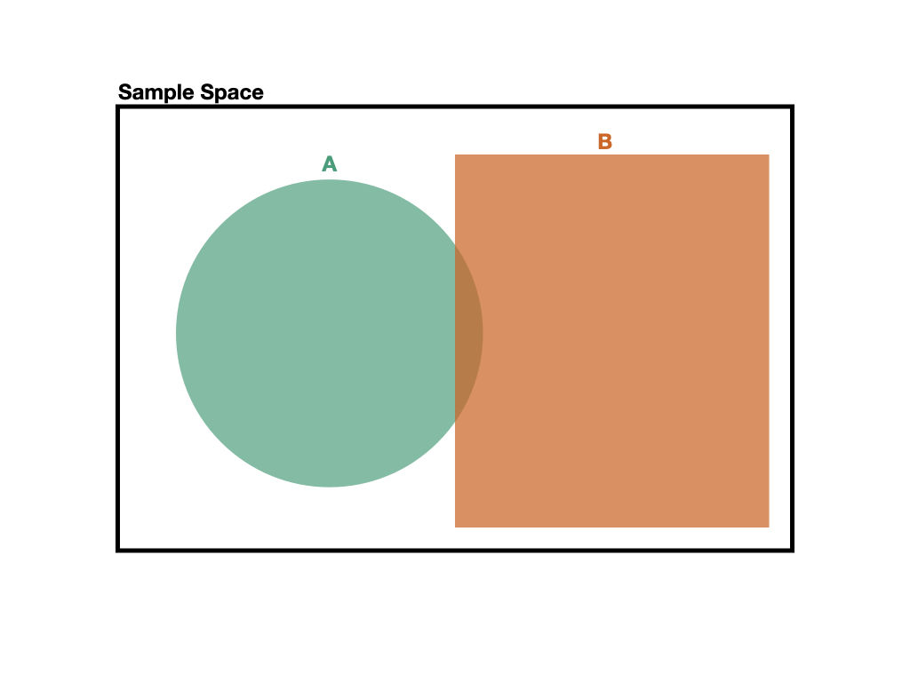
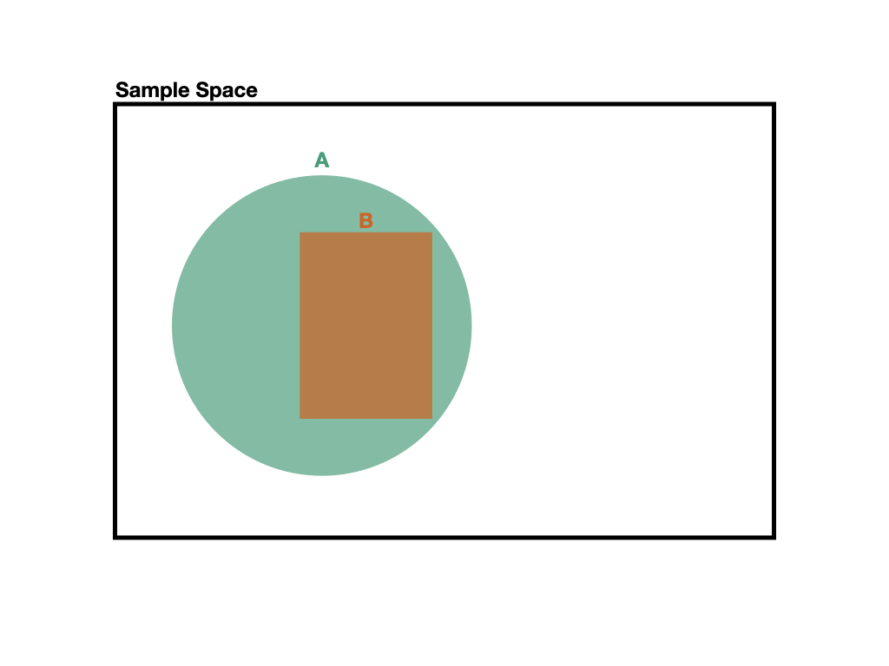
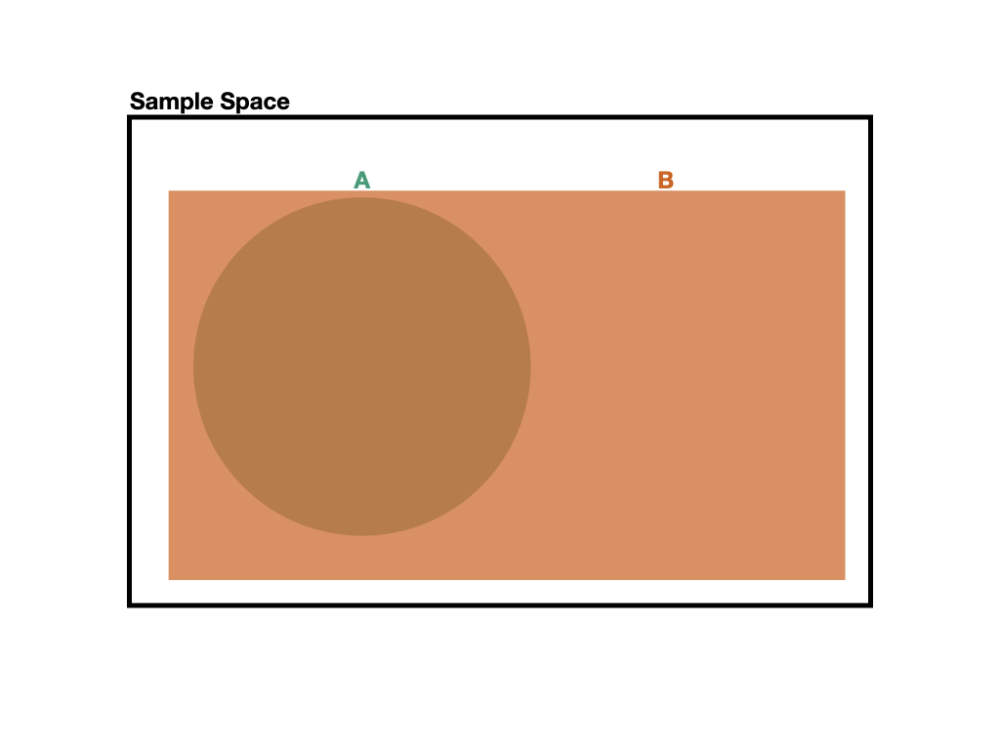

```{r setup, include=FALSE}
knitr::opts_chunk$set(echo = FALSE)

library(tidyverse)
```

## Revisions

You can find the latest versions of the slides in their [GitHub repo](https://github.com/pos5737/prob-slides). If you have any suggestions, feel free to [open an issue ticket](https://github.com/pos5737/prob-slides/issues).

# Basics

## Supplemental Readings for Section 1

The following readings expand on the ideas in these notes. FPP provides a nice conceptual discussion. Aronow and Miller give a more technical presentation, but remains gentle and compact. DeGroot and Schervish offer a thorough introduction. 

- FPP, chs. 13 and 14 (pp. 221-224)
- Aronow and Miller, ch. 1, section 1.1 (pp. 3-15)
- DeGroot and Schervish, ch. 1, sections 1.1-1.7, 1.10, 2.1-2.3.
- Casella and Berger, ch. 1, sections 1.1-1.3.

## 

\begin{dfn}
An \textbf{experiment} is a repeatable procedure to obtain an observation from a defined set of outcomes.
\end{dfn}

\pause

\begin{dfn}
The \textbf{sample space} $S$ is the collection of all possible outcomes of the experiment.
\end{dfn}

\pause

\begin{dfn}
A \textbf{realization} of the experiment produces an outcome from the sample space.
\end{dfn}

\pause

\begin{dfn}
An \textbf{event} $A$ is a subset of the sample space.
\end{dfn}

## Axioms of Probability (Kolmogorov Axioms)
\small

\begin{axm}\label{axm:1}
For every event $A$, $\Pr(A) \geq 0$.
\end{axm}

\pause

\begin{axm}\label{axm:2}
$\Pr(S) = 1$.
\end{axm}

\pause

\begin{axm}\label{axm:3}
For every infinite sequence of disjoint events $A_1, A_2, ...$, 
\begin{equation}
\Pr \left( \displaystyle \bigcup_{i = 1}^\infty A_i \right) = \displaystyle \sum_{i = 1}^\infty \Pr(A_i). \nonumber
\end{equation}
\end{axm}

## Notes on Axiom \ref{axm:3}

Examples of an infinite sequence of disjoint events? For $S = \mathbb{R}^+$? For $S =\{0, 1\}$?

\pause An infinite sequence of disjoint events is difficult to conceptualize. 

- \pause For $S = \mathbb{R}^+$, \textit{one} such sequence would be $[0, 1), [1, 2), [2, 3), ...$.  
- \pause For $S =\{0, 1\}$, \textit{one} such sequence would be $\{0\}, \{1\}, \emptyset, \emptyset, \emptyset,...$.

## 

\begin{dfn}
For a sample space $S$, a \textbf{probability} is a collection of real numbers assigned to all events $A$ consistent with Axioms \ref{axm:1}, \ref{axm:2}, and \ref{axm:3}
\end{dfn}

## Interpretations of "Probability"

- We can interpret this probability of $A$ as the fraction of time that $A$ occurs in this long-run when we repeat the experiment over-and-over. This is known as the **frequentist** interpretation of probability. 
- \pause We can also interpret the probability as your beliefs about $A$.  This is known as the **Bayesian** interpretation.

\pause Coin Toss example.

##

\begin{thm}\label{thm:empty-zero}
$\Pr(\emptyset) = 0$. 
\end{thm}

\begin{Exercise}
Prove Theorem \ref{thm:empty-zero}. Hint: Use Axiom \ref{axm:3}.
\end{Exercise}

**Solution**

<!-- $\Pr(\emptyset) = \Pr(\cup_{i = 1}^\infty \emptyset) = \sum_{i = 1}^\infty \Pr(\emptyset)$. $\Pr(\emptyset) = \sum_{i = 1}^\infty \Pr(\emptyset)$ iff $\Pr(\emptyset) = 0$.} -->

##


\begin{thm}\label{thm:add-disjoint}
For every finite sequence of $n$ disjoint events $A_1, A_2, ..., A_n$,
\begin{equation}
\Pr \left( \displaystyle \bigcup_{i = 1}^n A_i \right) = \displaystyle \sum_{i = 1}^n \Pr(A_i). \nonumber
\end{equation}
\end{thm}

\pause

\begin{cor}[Addition Rule for Two Disjoint Events]\label{cor:addition-rule}
For disjoint events $A$ and $B$, $\Pr ( A \cup B) = \Pr(A) + \Pr(B)$
\end{cor}

\begin{proof}
This follows directly from Theorem \ref{thm:add-disjoint}. 
\end{proof}

##

\begin{thm}\label{thm:monotonicity}
If events $A \subseteq B$, then $\Pr(A) \leq \Pr(B)$. 
\end{thm}

\begin{Exercise}
Prove Theorem \ref{thm:monotonicity}. Hint: Notice that $B = A \cup (B \cap A^c)$. Then use the Additional Rule for Two Disjoint Events (Corollary \ref{cor:addition-rule}).
\end{Exercise}

**Solution**

<!--- $B = A \cup (B \cap A^c)$. By the addition rule for disjoint events, $\Pr(B) = \Pr(A) + \Pr(B \cap A^c)$. By Axiom 1, $\Pr(B \cap A^c) \geq 0$, so $\Pr(A) \leq \Pr(B)$. -->

##

\begin{thm}\label{thm:bounds}
For event $A$, $0 \leq \Pr(A) \leq 1$. 
\end{thm}

\begin{Exercise}
Prove Theorem \ref{thm:bounds}. Hint: Axiom \ref{axm:1} established that $0 \leq \Pr(A)$. Now show that $\Pr(A) \leq 1$. To do this, use Axiom \ref{axm:2} and Theorem \ref{thm:monotonicity}.
\end{Exercise}

**Solution**

<!-- $A \subseteq S$. $\Pr(A) \leq \Pr(S)$. By Axiom 1, $\Pr(S) = 1$, so $\Pr(A) \leq 1$. -->

##

\begin{thm}[Addition Rule for Two Events]
For any events $A$ and $B$, $\Pr ( A \cup B) = \Pr(A) + \Pr(B) - \Pr(A \cap B)$.
\end{thm}

\pause

\begin{thm}[Addition Rule for Three Events]
For any events $A$, $B$, and $C$,
 \begin{align*}
 \Pr ( A \cup B \cup C) &= \Pr(A) + \Pr(B) + \Pr(C)\\
                                   &- \left[ \Pr(A \cap B) + \Pr(A \cap C) + \Pr(B \cap C) \right]\\
                                   &+ \Pr(A \cap B \cap C).
                                   \end{align*}
\end{thm}

##

\begin{Exercise} 
If they answer honestly and accurately, a randomly selected survey respondent will report voting in the 2016 presidential election with probability 0.6. What's the probability that a randomly selected survey respondent will report not voting. Make sure to connect your answer to the results above. Hint: show that $\Pr(A^c) = 1 - \Pr(A)$. We haven't established this simple, intuitive result. Then use this result to answer the question.
\end{Exercise}

**Solution**

<!-- $\Pr(S) = \Pr(A) + \Pr(A^c)$. Then $1 = \Pr(A) + \Pr(A^c)$ and $\Pr(A^c) =  1-  \Pr(A)$. Then $\Pr(\text{non-voter}) = 0.4$. -->

##

\begin{Exercise}
Suppose events $A$ and $B$, where $\Pr(A) = 0.5$ and $\Pr(B) = 0.8$. Without more information, you can't figure out $\Pr(A \cap B)$, but you can bound it. What is the largest possible value of $\Pr(A \cap B)$? What's the smallest?
\end{Exercise}

**Solution**

<!-- Remember that $\Pr(A \cap B) = \Pr(A)\Pr(B \mid A)$. Because $A$ is smaller than $B$, it could be that all of $A$ is inside $B$, in which case $\Pr(B \mid A) = 1$ and $\Pr(A \cap B) = \Pr(A) = 0.5$. Or it could be that $\Pr(B \mid A^c) = 1$, in which case $\Pr(B \cap A^c) = \Pr(B \mid A^c) \Pr(A^c) = 1 \times 0.5 = 0.5$. Then $\Pr(B) = \Pr(B \cap A^c) + \Pr(B \cap A) = 0.8$, according to the Addition Rule for Disjoint Events (that's a "partition, see below). So we have $.5 + \Pr(B \cap A)  = 0.8$ or $\Pr(B \cap A) = 0.3$. -->

##

\begin{dfn}[Conditional Probability]\label{dfn:conditional-probability}
$\Pr(A \mid B) = \dfrac{\Pr(A \cap B)}{\Pr(B)}$ for $\Pr(B) > 0$. If $\Pr(B) = 0$, then $\Pr(A \mid B)$ is undefined.
\end{dfn}

## A Note on Conditional Probability

We interpret the conditional probability $\Pr(A \mid B)$ as the probability of $A$ given that $B$ happens (or has already happened). Suppose a bag with two green marbles and two red marbles. I draw two marbles without replacement and see that the first is green. Then the probability that the second is green, given that the first is/was green, is

\small
\begin{equation*}
\Pr(\text{second is green} \mid \text{first is green}) = \frac{\Pr(\text{second is green AND first is green})}{\Pr (\text{first is green)}}.
\end{equation*}

## An Intuition for Conditional Probability

\huge

\textbf{Carlisle's Happy-Sad Principle}

\normalsize

If event $A$ happens, you win \$100. You see that event $B$ happens. Are you now \textbf{happy} (more likely to win), \textbf{sad} (less likely to win), or \textbf{indifferent} (equally likely to win)?


## A Visualization of Conditional Probability



## A Visualization of Conditional Probability



## A Visualization of Conditional Probability



##

\begin{thm}[Multiplication Rule for Two Events]
For events $A$ and $B$, $\Pr(A \cap B) = \Pr(B)\Pr(A | B)$ if $\Pr(B) > 0$. Similarly, $\Pr(A \cap B) = \Pr(A)\Pr(B | A)$ if $\Pr(A) > 0$.
\end{thm}

##

\begin{thm}[Multiplication Rule for $n$ Events]
For events $A_1, A_2,..., A_n$ where $\Pr(A_1 \cap A_2 \cap ... \cap A_{n-1}) > 0$,
\begin{align*}
\Pr(A_1 \cap A_2 \cap ... \cap A_n) &= \Pr(A_1)\\
    							& \times \Pr(A_2 \mid A_1)\\
							& \times \Pr(A_3 \mid A_2, A_1) \\
							& \times ...\\
							& \times \Pr(A_n \mid A_{n-1}, ..., A_2, A_1) 
\end{align*}
\end{thm}

## 

\begin{Exercise}
Simplify $\Pr(A \mid B)$ for the following scenarios. Connect your answers to the results above.
  \begin{enumerate}
  \item $A \subset B$ and $\Pr(B) > 0$.
  \item $A$ and $B$ are disjoint and $\Pr(B) > 0$.
  \item $B$ is the empty set (tricky!).
  \item $B$ is the sample space $S$.
  \end{enumerate}
\end{Exercise}

**Solution**

<!-- (1) $\Pr(A)/\Pr(B)$, (2) 0, (3) not defined, (4) $\Pr(A)\Pr(B)$ -->

##

\begin{Exercise}
Voting is a habit. Suppose that elections occur every four years and a hypothetical voter can vote in their first election at 18 in 2020. They vote in their first election with probability 0.5. If they voted in the last election, then they vote in the next election with probability 0.8. If they abstained in the last election, then they vote in the next election with probability 0.3. What is the probability that they vote in their first three election (i.e., vote, then vote, then vote)? What the probability that they abstain in their first three elections (i.e., abstain, then abstain, then abstain)? What's the probability that they either vote or abstain in their first three elections (i.e., [vote, then vote, then vote] \textit{OR} [abstain, then abstain, then abstain])?
\end{Exercise}

**Solution**

<!-- $0.5 \times 0.8 \times 0.8$; $0.5 \times 0.7 \times 0.7$; the sum of the two previous -->


## 

\begin{dfn}[Independence of Two Events]\label{dfn:independence}
Events $A$ and $B$ are \textbf{independent} if $\Pr(A \cap B) = \Pr(A) \Pr(B)$.
\end{dfn}

If $\Pr(A) > 0$ and $\Pr(B) > 0$, then Definitions \ref{dfn:conditional-probability} and \ref{dfn:independence} imply that two events are independent if and only if their conditional probabilities equal their unconditional probabilities so that $\Pr(A \mid B) = \Pr(A)$ and $\Pr(B \mid A) = \Pr(B)$.

##

\begin{dfn}[Independence of $n$ Events]\label{dfn:independence-n}
Events $A_1, A_2, ..., A_n$ are \textbf{independent} if for every subset $A_a,..., A_m$ with at least two events, $\Pr(A_a \cap ... \cap A_m) = \Pr(A_a)...\Pr(A_m)$.
\end{dfn}

The "every subset'" part of Definition \ref{dfn:independence-n} is subtle, so let's create a specific example. "Every subset" of $A$, $B$, and $C$ with at least two events includes the following: $\{A, B\}$, $\{A, C\}$, $\{B, C\}$, and $\{A, B, C\}$. 

##

\begin{Exercise}
Suppose $A$ and $B$ are independent and $\Pr(B) < 1$. Find $\Pr(A^c | B^c)$ in terms of $A$ and $B$. Prove that $A^c$ and $B^c$ are independent.
\end{Exercise}

**Solution**
<!--
\scriptsize

First, show that $A^c$ and $B^c$ are independent. 

\begin{align*}
\Pr(A^c \cap B^c) & = \Pr([A \cup B]^c) \\
                  & = 1 - \Pr(A \cup B) \\
                  & = 1 - [\Pr(A) + \Pr(B) - \Pr(A \cap B)] \\
                  & = 1 - \Pr(A) - \Pr(B) + \Pr(A)\Pr(B) \\
                  & = [1 - \Pr(A)] \times [1 - \Pr(B)] \\
                  & = \Pr(A^c) \times \Pr(B^c)
\end{align*}

Then, by independence, we know that $\Pr(A^c | B^c) = \Pr(A^c)$ and that $\Pr(A^c) = 1 - \Pr(A)$.
-->


##


\begin{Exercise}
Suppose $A$ and $B$ are events and $\Pr(B) = 0$. ($A$ is any event.) Find $\Pr(A \cap B)$. Prove that $A$ and $B$ are independent.
\end{Exercise}

**Solution**
<!--
If $A$ and $B$ are independent, then $\Pr(A \cap B) = \Pr(A) \Pr(B)$. Well, if $\Pr(B) = 0$, then $\Pr(A \cap B)$ must be zero. If the chance of $B$ is zero, then the chance of $A$ and $B$ is zero. Thus the two sides are equal and therefore independent.
-->

##

\begin{Exercise}
Suppose a six-sided die is rolled 10 times. What's the probability of...
  \begin{enumerate}
  \item all sixes?
  \item not all-sixes?
  \item all not-sixes?
  \end{enumerate}
\end{Exercise}

**Solution**
<!--
(1) $(1/6)^{10}$, (2) $1 - (1/6)^{10}$, (3) $(5/6)^{10}$
-->

##

\begin{dfn}\label{dfn:partition}
To create a \textbf{partition} $B_1, B_2, ..., B_k$ of the sample space $S$, divide $S$ into $k$ disjoint events $B_1, B_2, ..., B_k$ so that $\bigcup_{i = 1}^n B_i = S$.
\end{dfn}

\begin{thm}[Law of Total Probability]\label{thm:total-prob}
Suppose a partition (see Definition \ref{dfn:partition}) $B_1, B_2, ..., B_k$ of the sample space $S$ where $\Pr(B_j) > 0$ for $j = 1, 2, ... , k$. Then
\begin{equation*}
\Pr(A) = \displaystyle \sum_{j = 1}^k \Pr(B_j )\Pr(A \mid B_j).
\end{equation*}
\end{thm}

##

\begin{thm}[Bayes' Rule]
Suppose a partition (see Definition \ref{dfn:partition}) $B_1, B_2, ..., B_k$ of the sample space $S$ where $\Pr(B_j) > 0$ for $j = 1, 2, ... , k$. Suppose  an event $A$, where $\Pr(A) > 0$. Then

\begin{equation*}
\Pr(B_i \mid A) = \dfrac{\Pr(B_i) \Pr(A \mid B_i)}{\sum_{j = 1}^k \Pr(B_j )\Pr(A \mid B_j)}.
\end{equation*}
\end{thm}

We can simplify the rule a bit by assuming the partition $B$ and $B^c$. In applications, this partition is usually sufficient (see Exercise \ref{exr:bayes-rule}).

\begin{thm}[Bayes' Rule for a simpler partition]
Suppose the simple partition $B$ and $B^c$ of the sample space $S$ where $\Pr(B) > 0$ and $\Pr(B^c) > 0$. Suppose  an event $A$, where $\Pr(A) > 0$. Then

\begin{equation*}
\Pr(B \mid A) = \dfrac{\Pr(B) \Pr(A \mid B)}{\Pr(B) \Pr(A \mid B) + \Pr(B^c) \Pr(A \mid B^c)}.
\end{equation*}
\end{thm}

## 

\begin{Exercise}\label{exr:bayes-rule}
You're considering getting tested for a rare disease that 1 in 100,000 people have. If given to a person with the disease, the test will produce a positive result 99\% of the time. If given to a person without the disease, the test will produce a positive result 0.1\% of the time (i.e., 1 in 1,000). You are given the test and the result comes back positive. Use Bayes' rule to compute the chance that you have the disease. 
\end{Exercise}

